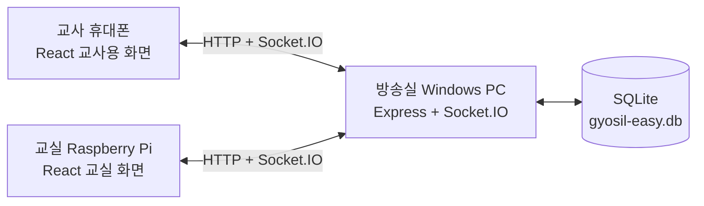

# 시스템 구조



모든 통신은 1차 버전에서 학교 내부 네트워크 안에서 이루어집니다. 교사와 교실 화면은 먼저 REST API로 현재 상태를 받고, 이후 Socket.IO 이벤트로 변경 사항을 즉시 반영합니다. 네트워크가 잠시 끊기면 자동 재연결한 뒤 REST 상태를 다시 읽어 누락을 복구합니다.

## 메시지 흐름

1. 교사가 `call` 또는 `question` 메시지를 전송합니다.
2. 서버가 SQLite에 먼저 저장합니다.
3. 서버가 해당 `room` 채널의 Raspberry Pi와 교사 화면에 `message:new` 이벤트를 보냅니다.
4. 학생이 프리셋 버튼 또는 직접 입력으로 응답합니다.
5. 서버가 응답을 저장하고 `response:new` 이벤트를 보냅니다.
6. 교사가 확인 후 종료하면 상태가 `closed`가 되고 기록에 남습니다.

## 데이터 파일

기본 데이터베이스 경로는 `server/data/gyosil-easy.db`입니다. SQLite WAL 모드를 사용하며, 별도의 MySQL/PostgreSQL 서버는 필요하지 않습니다.

## 교실 분리

URL의 `room` 값이 같은 기기만 같은 메시지를 받습니다.

```text
/#/teacher?room=classroom-1
/#/classroom?room=classroom-1
```

교실별로 `classroom-1`, `classroom-2`처럼 코드를 다르게 지정할 수 있습니다.
