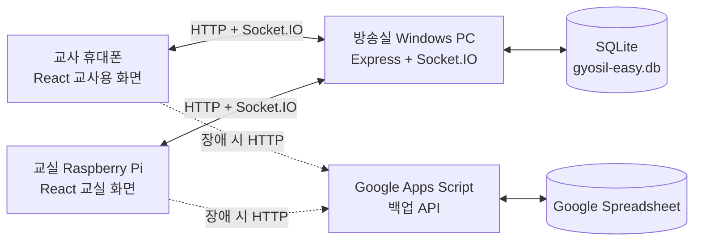

# 시스템 구조



모든 통신은 1차 버전에서 학교 내부 네트워크 안에서 이루어집니다. 교사와 교실 화면은 먼저 REST API로 현재 상태를 받고, 이후 Socket.IO 이벤트로 변경 사항을 즉시 반영합니다. 네트워크가 잠시 끊기면 자동 재연결한 뒤 REST 상태를 다시 읽어 누락을 복구합니다.

## 서버 우선순위와 자동 전환

방송실 Windows PC의 REST API와 Socket.IO가 항상 `PRIMARY`입니다. REST 요청이 네트워크 오류,
시간 초과, `408`, `429`, 또는 `5xx` 응답으로 실패하면 같은 요청을 Google Apps Script
`BACKUP` API에 보냅니다. 입력 오류나 PIN 오류와 같은 `4xx` 응답은 서버 장애가 아니므로 백업에
재전송하지 않습니다. 백업 사용 중에는 5초마다 상태를 조회하며, 방송실 서버가 복구되면 다음
조회부터 자동으로 PRIMARY로 돌아갑니다. Apps Script는 Socket.IO를 제공하지 않으므로 백업 중
변경 사항은 5초 이내에 화면에 반영됩니다.

두 API는 이 문서의 REST 주소와 JSON 형식을 동일하게 제공해야 합니다. 백업 배포 주소는 기본값이
설정되어 있으며 빌드 환경 변수로 바꾸거나 빈 값으로 비활성화할 수 있습니다.

```dotenv
VITE_SERVER_URL=http://192.168.0.50:3000
VITE_BACKUP_SERVER_URL=https://script.google.com/macros/s/배포_ID/exec
VITE_API_TIMEOUT_MS=4000
```

## 메시지 흐름

1. 교사가 `call` 또는 `question` 메시지를 전송합니다.
2. 서버가 SQLite에 먼저 저장합니다.
3. 서버가 해당 `room` 채널의 Raspberry Pi와 교사 화면에 `message:new` 이벤트를 보냅니다.
4. 학생이 프리셋 버튼 또는 직접 입력으로 응답합니다.
5. 서버가 응답을 저장하고 `response:new` 이벤트를 보냅니다.
6. 교사가 확인 후 종료하면 상태가 `closed`가 되고 기록에 남습니다.

## 데이터 파일

기본 데이터베이스 경로는 `server/data/gyosil-easy.db`입니다. SQLite WAL 모드를 사용하며, 별도의 MySQL/PostgreSQL 서버는 필요하지 않습니다.

## 교실 분리

URL의 `room` 값이 같은 기기만 같은 메시지를 받습니다.

```text
/#/teacher?room=classroom-1
/#/classroom?room=classroom-1
```

교실별로 `classroom-1`, `classroom-2`처럼 코드를 다르게 지정할 수 있습니다.
